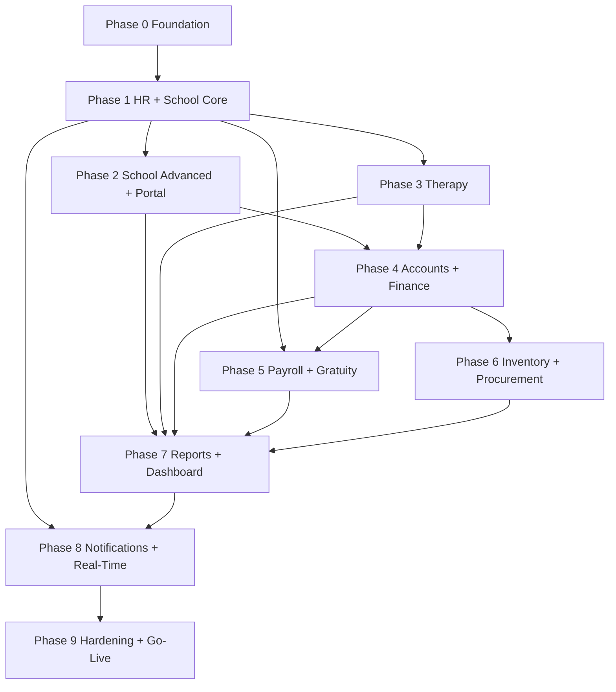

# Backend Implementation Plan — Overview

Special School & Therapy Center Management Software (SSERP)

| Field | Value |
|---|---|
| Document | Backend Implementation Plan — Overview |
| Version | 1.0 |
| Source of truth | [TechnicalDesignDocument_SpecialSchool.md](../../design/TechnicalDesignDocument_SpecialSchool.md), [SpecialSchool_TherapeCenter_Feature_List.md](../../feature/SpecialSchool_TherapeCenter_Feature_List.md) |
| Repository | `sserp-backend` |
| Audience | Backend engineers, tech lead, QA automation engineers |

---

## 1. How to use this plan

This directory contains one file per delivery phase. Each phase file is self-contained and buildable in isolation by a developer who has read only this overview plus that phase file. A phase file always contains the same eleven sections:

1. Objective and scope
2. Prerequisites (what must already be merged)
3. Prisma schema additions
4. Module and file structure
5. API endpoints
6. Business rules and invariants
7. Domain events emitted and consumed
8. Background jobs and cron
9. Configuration and secrets introduced
10. Tests owed by this phase
11. Exit criteria (Definition of Done)

| File | Phase | TDD duration |
|---|---|---|
| [01-phase0-foundation.md](01-phase0-foundation.md) | Phase 0 — Foundation | 3 weeks |
| [02-phase1-hr-school-core.md](02-phase1-hr-school-core.md) | Phase 1 — HR & School Core | 6 weeks |
| [03-phase2-school-advanced.md](03-phase2-school-advanced.md) | Phase 2 — School Advanced + Parent Portal | 5 weeks |
| [04-phase3-therapy.md](04-phase3-therapy.md) | Phase 3 — Therapy (individual + group) | 6 weeks |
| [05-phase4-accounts-finance.md](05-phase4-accounts-finance.md) | Phase 4 — Accounts & Finance | 5 weeks |
| [06-phase5-hr-payroll-gratuity.md](06-phase5-hr-payroll-gratuity.md) | Phase 5 — HR Advanced + Payroll | 4 weeks |
| [07-phase6-inventory-procurement.md](07-phase6-inventory-procurement.md) | Phase 6 — Inventory & Procurement | 4 weeks |
| [08-phase7-reports-dashboard.md](08-phase7-reports-dashboard.md) | Phase 7 — Reports & Dashboard | 4 weeks |
| [09-phase8-notifications-realtime.md](09-phase8-notifications-realtime.md) | Phase 8 — Notifications & Real-Time | 3 weeks |
| [10-phase9-hardening-golive.md](10-phase9-hardening-golive.md) | Phase 9 — Hardening, UAT & Go-Live | 3 weeks |
| [11-test-automation.md](11-test-automation.md) | Cross-phase — Test automation standards | Continuous |

Total: approximately 43 weeks with phases 4 and 5 partially overlapping.

---

## 2. Repository topology

The system is delivered as **two separate repositories**:

| Repository | Contents |
|---|---|
| `sserp-backend` | NestJS API, Prisma schema and migrations, Bull workers, Socket.io gateway, Docker Compose, backend test suites, k6 scripts |
| `sserp-frontend` | Next.js 14 App Router application, component library, Playwright E2E suite, visual regression baselines |

### Contract sharing

The backend is the contract owner. There is no shared TypeScript package between repos.

```
NestJS controllers + @nestjs/swagger decorators
  → GET /api/v1/docs-json  (OpenAPI 3.1 document)
  → committed to sserp-backend as openapi/openapi.json on every merge to main
  → published as a GitHub Actions artifact + pushed to sserp-frontend via a bot PR
  → sserp-frontend runs `openapi-typescript` to regenerate src/types/api.generated.ts
```

**Rules:**

- Every controller method must carry `@ApiOperation`, `@ApiResponse`, and typed DTOs. A CI check fails the build if any route is missing an OpenAPI response schema.
- `openapi/openapi.json` is committed. A CI step regenerates it and fails if the committed copy is stale — this makes contract changes visible in code review.
- Breaking contract changes require a `BREAKING-API:` prefix in the commit body and a coordinating issue in `sserp-frontend`.

---

## 3. Technology stack (fixed by TDD section 4.2)

| Concern | Choice |
|---|---|
| Runtime | Node.js 20 LTS |
| Framework | NestJS 10.x |
| Language | TypeScript 5.x, `strict: true` |
| ORM | Prisma 5.x |
| Database | PostgreSQL 16 |
| Cache / queue backend / pub-sub | Redis 7 |
| Object storage | MinIO (S3-compatible) |
| Queues | BullMQ 4.x |
| Real-time | Socket.io 4.x |
| Auth | Passport.js JWT strategy, RS256 |
| Validation | class-validator + class-transformer |
| Logging | winston (structured JSON) |
| Email | Nodemailer |
| Cron | `@nestjs/schedule` (node-cron under the hood) |
| PDF | Puppeteer + Handlebars |
| Security headers | Helmet + CORS |

No additions to this list without a written ADR in `docs/adr/`.

---

## 4. Project structure

```
sserp-backend/
├── prisma/
│   ├── schema/                    # split schema files, merged by prismaSchemaFolder
│   │   ├── base.prisma            # datasource, generator, shared enums
│   │   ├── auth.prisma
│   │   ├── school.prisma
│   │   ├── therapy.prisma
│   │   ├── hr.prisma
│   │   ├── accounts.prisma
│   │   ├── inventory.prisma
│   │   └── procurement.prisma
│   ├── migrations/
│   └── seed/
│       ├── dev.seed.ts            # rich local dataset
│       └── reference.seed.ts      # roles, permissions, chart of accounts — runs in every env
├── src/
│   ├── main.ts
│   ├── app.module.ts
│   ├── worker.main.ts             # separate entrypoint for the Bull worker container
│   ├── modules/
│   │   ├── auth/
│   │   ├── admin/                 # users, roles, org config, audit log viewer
│   │   ├── school/
│   │   ├── therapy/
│   │   ├── hr/
│   │   ├── accounts/
│   │   ├── finance/
│   │   ├── inventory/
│   │   ├── procurement/
│   │   ├── reports/
│   │   ├── notifications/
│   │   ├── portal/                # parent portal read models + write workflows
│   │   └── files/                 # MinIO presign, upload confirm, download proxy
│   └── shared/
│       ├── decorators/            # @CurrentUser, @Roles, @Permissions, @Audit, @IdempotentPost
│       ├── guards/                # JwtAuthGuard, RolesGuard, PermissionsGuard, PortalScopeGuard
│       ├── interceptors/          # AuditInterceptor, LoggingInterceptor, EnvelopeInterceptor
│       ├── filters/               # GlobalExceptionFilter
│       ├── pipes/                 # ZodOrClassValidatorPipe
│       ├── events/                # event name constants + payload interfaces
│       ├── prisma/                # PrismaService, transaction helper, soft-delete extension
│       ├── cache/                 # RedisCacheService with typed key builders
│       ├── money/                 # Money value object, minor-unit helpers
│       ├── datetime/              # timezone-safe date helpers
│       └── testing/               # factories, container harness, auth token helpers
├── test/
│   ├── integration/               # Supertest + Testcontainers suites
│   └── setup/
├── k6/
├── openapi/
├── docker/
└── .github/workflows/
```

Every module directory follows the same internal shape:

```
modules/<module>/
├── <module>.module.ts
├── controllers/
├── services/
├── repositories/
├── dto/
├── entities/          # domain types not mapped 1:1 to Prisma models
├── events/            # event payload definitions owned by this module
├── listeners/         # @OnEvent handlers this module registers
├── jobs/              # Bull processors owned by this module
└── policies/          # authorization scope resolvers (e.g. "teacher sees own students")
```

---

## 5. Cross-cutting conventions

These are non-negotiable and enforced by lint rules, CI checks, or code review. Every phase file assumes them.

### 5.1 Data model

| Rule | Detail |
|---|---|
| Primary keys | `UUID`, default `gen_random_uuid()`. Never expose sequential integers. |
| Audit columns | Every table has `created_at TIMESTAMPTZ`, `updated_at TIMESTAMPTZ`, `created_by UUID`, `updated_by UUID`. Applied by a Prisma client extension, not manually. |
| Soft delete | `students`, `employees`, `patients`, `users`, `vendors` carry `deleted_at TIMESTAMPTZ`. A Prisma extension adds `deletedAt: null` to every default query; explicit opt-in via `withDeleted()` repository method. |
| Money | Always `INTEGER`, in the smallest currency unit (paisa). Never `FLOAT`, never `DECIMAL` for currency. Column names end in `_amount` or `_salary`. All arithmetic goes through `shared/money`. |
| Timestamps | Stored UTC. Converted to org timezone only at the presentation boundary (report renderers, PDF templates, notification bodies). |
| Dates without time | `DATE` type for business dates (attendance date, invoice date). Never `TIMESTAMPTZ` — avoids timezone drift on day boundaries. |
| Enums | Stored as `VARCHAR` with a Postgres `CHECK` constraint plus a TypeScript union type, not a Postgres `ENUM` (avoids painful migrations). |
| Foreign keys | Enforced at DB level. `ON DELETE RESTRICT` default; `CASCADE` only for owned child rows (e.g. `iep_goals` → `iep_plans`). |
| Naming | `snake_case` in Postgres, `camelCase` in Prisma client via `@map` / `@@map`. |

### 5.2 API

| Rule | Detail |
|---|---|
| Base path | `/api/v1` |
| Envelope | Every success response wrapped by `EnvelopeInterceptor` into `{ success, data, meta?, timestamp }` |
| Errors | `GlobalExceptionFilter` emits `{ success: false, statusCode, error, message, details?, timestamp, requestId }` |
| Pagination | Cursor-based on high-volume lists (`?cursor=&limit=`, max 100). Page-based on report endpoints (`?page=&pageSize=`). |
| Filtering | Explicit query DTOs with class-validator. No generic query-object parsing. |
| Idempotency | All `POST` endpoints that create financial records or send notifications accept an `Idempotency-Key` header, stored in Redis for 24h. |
| Status codes | Per TDD 15.1. In particular: `409` for business rule conflicts (double-booking, shift cap), `422` for semantic prerequisites (fee not paid). |
| Versioning | URI versioning via NestJS `VersioningType.URI`. |

### 5.3 Error codes

A single `ErrorCode` enum in `shared/errors/error-codes.ts` backs the `error` field. The frontend switches on it, so codes are contract. Examples introduced across phases:

| Code | HTTP | Meaning |
|---|---|---|
| `VALIDATION_ERROR` | 400 | DTO validation failed |
| `UNAUTHENTICATED` | 401 | Missing/invalid token |
| `FORBIDDEN` | 403 | RBAC or scope denial |
| `NOT_FOUND` | 404 | Entity missing or outside caller scope |
| `SHIFT_CAP_EXCEEDED` | 409 | Teacher already mapped in that shift |
| `SCHEDULE_CONFLICT` | 409 | Therapist / room / patient double-booked |
| `ADMISSION_FEE_PENDING` | 422 | Operation blocked until fee cleared or waived |
| `JOURNAL_UNBALANCED` | 422 | Debit total ≠ credit total |
| `BUDGET_EXCEEDED` | 422 | Posting exceeds cost-center budget |
| `PAYROLL_LOCKED` | 409 | Payroll run already locked |
| `RATE_LIMITED` | 429 | Throttler triggered |

### 5.4 Authorization

Three layers, all mandatory:

1. **Route guard** — `@Roles('coordinator', 'principal')` checked by `RolesGuard`, or `@Permissions('school:create')` checked by `PermissionsGuard` against `role_permissions`.
2. **Scope policy** — service layer applies a scope filter resolved from the authenticated user. A teacher's student queries are narrowed by `student_teacher_mappings`; a parent's are narrowed to their linked guardian's students. Implemented as `policies/<entity>.policy.ts` returning a Prisma `where` fragment.
3. **Row-Level Security** — Postgres RLS on `student_medical_records`, `session_notes`, `payroll_slips` as a last line of defence (Phase 9).

A Semgrep rule fails CI if any controller method lacks both `@Roles` and `@Permissions`, unless explicitly marked `@Public()`.

### 5.5 Transactions

- Any operation that writes to more than one aggregate runs in a single `prisma.$transaction`.
- Financial postings **always** run in the same transaction as the source record write. There is no "record the payment now, post the ledger entry later" path.
- Domain events are emitted **after** the transaction commits, via an outbox-lite pattern: the service collects events during the transaction and the `TransactionalEventPublisher` flushes them on commit. This prevents listeners from observing uncommitted state.

### 5.6 Audit

`AuditInterceptor` writes an `audit_logs` row for every non-GET request that succeeds, capturing user, action, module, entity, before/after JSONB, and IP. Services register the entity snapshot via a request-scoped `AuditContext`. No API route can delete or update `audit_logs`; the DB grant for the application role excludes `UPDATE`/`DELETE` on that table.

---

## 6. Domain event catalogue

Cross-module communication uses NestJS `EventEmitter2` exclusively. No module imports another module's repository or Prisma model directly. Event names are constants in `shared/events/event-names.ts`; payload interfaces live beside them.

| Event | Emitted in | Emitter | Consumers | Outcome |
|---|---|---|---|---|
| `admission_fee.paid` | Phase 1 | School AdmissionFeeService | School StudentStatusListener, Accounts, Notifications | Student → active; AR receipt posting; parent notified |
| `admission_fee.waived` | Phase 1 | School AdmissionFeeService | School StudentStatusListener, Accounts | Student → active; waiver write-off posting |
| `student.activated` | Phase 1 | School StudentStatusListener | Portal, Notifications | Portal access unlocked |
| `hr.attendance.absent` | Phase 1 | HR AttendanceService | School SubstituteChecker | Flag affected students for substitute |
| `hr.leave.approved` | Phase 1 | HR LeaveService | School SubstituteChecker, Therapy ConflictAlerter, Notifications | Substitute prompt; therapy conflict warnings |
| `hr.leave.rejected` | Phase 1 | HR LeaveService | Notifications | Notify employee with reason |
| `substitute.unassigned` | Phase 1 | School SubstituteChecker | Notifications | Alert coordinator: absence with no substitute |
| `iep.published` | Phase 2 | School IEPService | Notifications, Portal | Parent alerted; portal read model refreshed |
| `iep.acknowledged` | Phase 2 | School IEPService | Audit, Notifications | Timestamped acknowledgment visible to coordinator |
| `progress_report.approved` | Phase 2 | School ProgressReportService | Notifications, Files | PDF render job; parent notified |
| `student_leave.approved` | Phase 2 | School StudentLeaveService | School AttendanceService, Notifications | Dates auto-marked `excused_leave` |
| `fee.invoice.generated` | Phase 2 | School FeeService | Accounts | AR entry raised |
| `fee.payment.received` | Phase 2 | School / Therapy | Accounts, Notifications | AR reduced; receipt posting |
| `activity.optin.confirmed` | Phase 2 | School ActivityService | School ActivityFeeService | Per-student activity invoice |
| `activity.cancelled` | Phase 2 | School ActivityService | Notifications | Notify all enrolled guardians |
| `therapy_session.cancelled` | Phase 3 | Therapy SessionService | Notifications | Guardian notified per affected patient |
| `therapy_session.completed` | Phase 3 | Therapy SessionService | Therapy BillingService | Invoice generation trigger |
| `group_session.completed` | Phase 3 | Therapy GroupService | Therapy BillingService | One invoice per enrolled patient |
| `therapist.license.expiring` | Phase 3 | CRON daily | Notifications | 30-day expiry alert |
| `payroll.run.completed` | Phase 5 | HR PayrollService | Accounts | Payroll expense journal |
| `gratuity.provision.monthly` | Phase 5 | CRON monthly | HR GratuityService, Accounts | Accrual computed and posted |
| `gratuity.eligibility.reached` | Phase 5 | HR GratuityService | Notifications | HR officer alerted |
| `encashment.approved` | Phase 5 | HR EncashmentService | HR PayrollService, Accounts | Added to next payroll run |
| `employee.contract.expiring` | Phase 5 | CRON daily | Notifications | 30-day expiry alert |
| `procurement.pr.status_changed` | Phase 6 | Procurement PRService | Notifications | Requester informed |
| `procurement.po.approved` | Phase 6 | Procurement POService | Accounts | AP commitment entry |
| `procurement.invoice.approved` | Phase 6 | Procurement InvoiceService | Accounts | AP payable entry |
| `inventory.grn.received` | Phase 6 | Procurement GRNService | Inventory StockService | Stock increment |
| `inventory.stock.low` | Phase 6 | Inventory StockService | Procurement, Notifications | Alert + optional auto-PR |
| `report.export.ready` | Phase 7 | Reports ExportService | Notifications | Download URL delivered |

Each phase file lists only the events it introduces or newly consumes.

---

## 7. Phase dependency graph



**Note on the Accounts dependency.** Phases 2 and 3 generate invoices and payments before the Accounts module exists. Rather than defer that revenue logic, Phase 1 introduces a **`LedgerPort` interface** in `shared/ports/ledger.port.ts` with a no-op-plus-outbox implementation. Fee and billing services depend on the port, not the Accounts module. Phase 4 swaps in the real `AccountsService` implementation and replays the outbox table (`pending_ledger_postings`) to backfill every posting generated in phases 1–3. This is described in detail in [05-phase4-accounts-finance.md](05-phase4-accounts-finance.md).

The same pattern applies to notifications: Phase 1 introduces a `NotificationPort` that writes only to the `notifications` table (in-app). Phase 8 swaps in the full implementation adding WebSocket push, email, and SMS. No phase-1..7 code changes when that happens.

---

## 8. Feature-to-phase traceability

Every section of the feature list is mapped to exactly one owning phase. Nothing is unassigned.

| Feature list section | Owning phase |
|---|---|
| 1.1 Shift Management | Phase 1 |
| 1.2 Student Enrollment & Profile, Admission Fee, Status Rule | Phase 1 |
| 1.3 Teacher Enrollment & Profile | Phase 1 |
| 1.4 Student–Teacher Mapping, Substitute Assignment | Phase 1 |
| 1.5 Attendance Management | Phase 1 |
| 1.6 IEP Management | Phase 2 |
| 1.7 Progress Reports | Phase 2 |
| 1.8 Fee Management | Phase 2 |
| 1.9 Holiday Management (integration) | Phase 1 |
| 1.10 Academic Year & Curriculum | Phase 1 (year), Phase 2 (curriculum/domains) |
| 1.11 Student Health & Medical Records | Phase 2 |
| 1.12 Student Behavioral Tracking | Phase 2 |
| 1.13 Optional Outdoor Activities (all sub-sections) | Phase 2 |
| 2.1–2.11 Therapy (therapists, patients, scheduling, sessions, plans, billing, referrals) | Phase 3 |
| 2.12 Group Therapy (all sub-sections) | Phase 3 |
| 3.1 Employee Management | Phase 1 |
| 3.2 HR Attendance Management | Phase 1 |
| 3.3 Leave Management + Holiday Master | Phase 1 |
| 3.3 Leave Encashment | Phase 5 |
| 3.3A Gratuity Management | Phase 5 |
| 3.4 Payroll Management | Phase 5 |
| 3.5 Performance Management | Phase 5 |
| 3.6 Recruitment | Phase 5 |
| 3.7 Training & Development | Phase 5 |
| 3.8 Employee Benefits | Phase 5 |
| 4.1–4.11 Accounts / Ledger (all) | Phase 4 |
| 5.1–5.4 Finance (shareholders, profit, reserves) | Phase 4 |
| 6.1–6.5 Inventory (all) | Phase 6 |
| 7.1–7.5 Procurement (all) | Phase 6 |
| 8.1–8.7 Report Module (all) | Phase 7 |
| 9.1 User Management | Phase 0 |
| 9.2 Organization Configuration | Phase 0 |
| 9.3 Workflow Configuration | Phase 8 |
| 9.4 Audit Trail | Phase 0 |
| 9.5 Data Backup & Security | Phase 9 |
| 10 Parent & Guardian Portal (all) | Phase 2 |
| 11.1–11.4 Communication & Notification | Phase 8 |
| 12.1–12.3 Dashboard & Analytics | Phase 7 |

---

## 9. Definition of Done — applies to every phase

A phase is not complete until all of the following hold. Individual phase files add phase-specific criteria on top.

**Code**

- [ ] All endpoints in the phase's API table implemented, guarded, and documented with `@nestjs/swagger`.
- [ ] `openapi/openapi.json` regenerated and committed.
- [ ] Every service method that mutates data runs inside a transaction where more than one aggregate is touched.
- [ ] No `any` in `src/` (ESLint `@typescript-eslint/no-explicit-any` at error level).
- [ ] All new configuration read through a typed `ConfigService` schema; no bare `process.env` in `src/`.

**Data**

- [ ] Prisma migration reviewed, reversible, and applied cleanly to an empty database and to a database seeded with the previous phase's data.
- [ ] Indexes from TDD section 6.7 relevant to the phase created and verified with `EXPLAIN ANALYZE` on a 10k-row seed.
- [ ] `reference.seed.ts` updated if the phase introduces reference data.

**Tests** (details in [11-test-automation.md](11-test-automation.md))

- [ ] Unit test coverage on the phase's service layer ≥ 80% line and branch.
- [ ] Overall project line coverage ≥ 70%.
- [ ] 100% of the phase's endpoints hit by at least one integration test.
- [ ] Every business rule in the phase's "Business rules and invariants" table has at least one negative-path test asserting the specific error code.
- [ ] Test factories added to `shared/testing/factories` for every new entity.
- [ ] Stryker mutation score on new service files ≥ 75%.
- [ ] k6 script added for any endpoint the phase introduces that appears in TDD 18.8.3.

**Security and operations**

- [ ] No new high or critical CVE (Snyk + `npm audit`).
- [ ] Semgrep RBAC rule passes — no unguarded controller methods.
- [ ] Winston log lines added for phase-critical state transitions; no sensitive fields logged.
- [ ] Any new secret documented in `.env.example` with a description and a safe default for local development.

**Documentation**

- [ ] Phase file updated in place if implementation diverged from plan, with the divergence noted and justified.
- [ ] ADR written for any deviation from the TDD.

---

## 10. Local development and CI

### Local

```bash
docker compose -f docker/docker-compose.dev.yml up -d   # postgres, redis, minio, mailhog
npm ci
npx prisma migrate dev
npx prisma db seed
npm run start:dev          # API on :3000
npm run start:worker:dev   # Bull worker
```

`mailhog` replaces the SMTP gateway locally so email flows are testable without a real provider. SMS uses a `ConsoleSmsProvider` in development, selected by `SMS_PROVIDER=console`.

### Branching

`main` is protected and always deployable. Work happens on `feat/phase<N>-<slug>` branches merged by squash. Every merge to `main` triggers the full gate chain described in [11-test-automation.md](11-test-automation.md).

### Environments

| Environment | Purpose | Data |
|---|---|---|
| local | Development | `dev.seed.ts` |
| ci | Ephemeral per-job Testcontainers | Programmatic factories |
| staging | E2E target, ZAP scans, k6 runs | `e2e-seed.ts` baseline, reset nightly |
| production | Live | Real data, restricted access |
