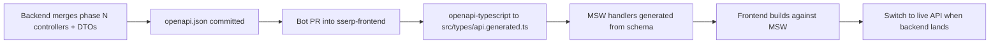
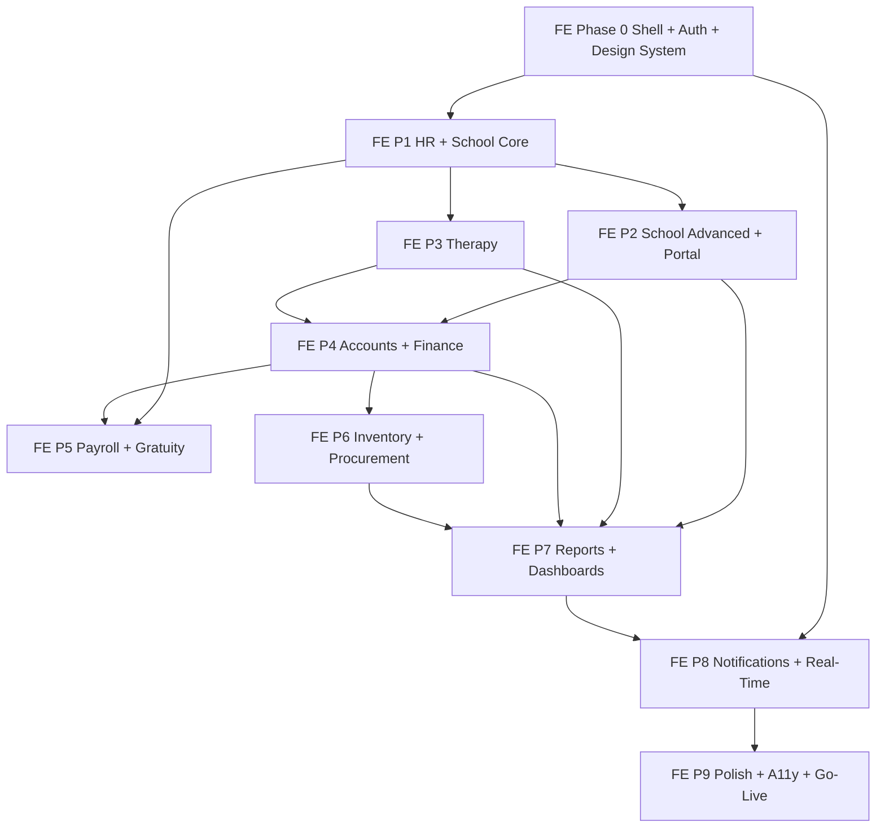

# Frontend Implementation Plan — Overview

Special School & Therapy Center Management Software (SSERP)

| Field | Value |
|---|---|
| Document | Frontend Implementation Plan — Overview |
| Version | 1.0 |
| Source of truth | [TechnicalDesignDocument_SpecialSchool.md](../../design/TechnicalDesignDocument_SpecialSchool.md), [SpecialSchool_TherapeCenter_Feature_List.md](../../feature/SpecialSchool_TherapeCenter_Feature_List.md) |
| Repository | `sserp-frontend` |
| Audience | Frontend engineers, tech lead, UI designer, QA automation engineers |

---

## 1. How to use this plan

One file per delivery phase, numbered to match the backend plan so backend phase N and frontend phase N deliver the same slice of functionality. Each phase file is self-contained and follows the same eleven sections:

1. Objective and scope
2. Prerequisites (backend contract and frontend dependencies)
3. Routes and page tree
4. Component inventory
5. Server state — hooks, query keys, mutations
6. Client state
7. Forms and validation
8. RBAC visibility
9. Accessibility and responsive requirements
10. Tests owed by this phase
11. Exit criteria

| File | Phase | Backend counterpart |
|---|---|---|
| [01-phase0-foundation.md](01-phase0-foundation.md) | Phase 0 — App shell, auth, design system | [backend/01](../backend/01-phase0-foundation.md) |
| [02-phase1-hr-school-core.md](02-phase1-hr-school-core.md) | Phase 1 — HR & School Core | [backend/02](../backend/02-phase1-hr-school-core.md) |
| [03-phase2-school-advanced-portal.md](03-phase2-school-advanced-portal.md) | Phase 2 — School Advanced + Parent Portal | [backend/03](../backend/03-phase2-school-advanced.md) |
| [04-phase3-therapy.md](04-phase3-therapy.md) | Phase 3 — Therapy (individual + group) | [backend/04](../backend/04-phase3-therapy.md) |
| [05-phase4-accounts-finance.md](05-phase4-accounts-finance.md) | Phase 4 — Accounts & Finance | [backend/05](../backend/05-phase4-accounts-finance.md) |
| [06-phase5-hr-payroll-gratuity.md](06-phase5-hr-payroll-gratuity.md) | Phase 5 — Payroll & Gratuity | [backend/06](../backend/06-phase5-hr-payroll-gratuity.md) |
| [07-phase6-inventory-procurement.md](07-phase6-inventory-procurement.md) | Phase 6 — Inventory & Procurement | [backend/07](../backend/07-phase6-inventory-procurement.md) |
| [08-phase7-reports-dashboard.md](08-phase7-reports-dashboard.md) | Phase 7 — Reports & Dashboards | [backend/08](../backend/08-phase7-reports-dashboard.md) |
| [09-phase8-notifications-realtime.md](09-phase8-notifications-realtime.md) | Phase 8 — Notifications & Real-Time | [backend/09](../backend/09-phase8-notifications-realtime.md) |
| [10-phase9-hardening-golive.md](10-phase9-hardening-golive.md) | Phase 9 — Hardening, A11y Certification, UAT & Go-Live | [backend/10](../backend/10-phase9-hardening-golive.md) |
| [11-test-automation.md](11-test-automation.md) | Cross-phase — Test automation standards | [backend/11](../backend/11-test-automation.md) |

---

## 2. Contract-first workflow — how the frontend avoids blocking on the backend

The backend owns the API contract and publishes an OpenAPI document. The frontend consumes it as generated types plus generated MSW handlers, which means **frontend phase N can start as soon as the backend merges phase N's contract, before the implementation is finished.**



**Rules**

- `src/types/api.generated.ts` is generated, committed, and never hand-edited. A CI check regenerates it and fails on drift.
- Every API call goes through a generated-type-checked wrapper. There is no hand-written response interface anywhere in `src/`.
- MSW handlers are generated with schema-faithful default responses, then overridden per test or per Storybook story with realistic fixtures.
- `NEXT_PUBLIC_API_MODE=msw|live` switches the development server between the mock and the real API, so a developer can work on a page whose backend is half-finished.
- A breaking contract change arrives as a bot PR that fails typecheck, making the break visible immediately rather than at runtime.

---

## 3. Technology stack (fixed by TDD section 4.1)

| Concern | Choice |
|---|---|
| Framework | Next.js 14.x, App Router |
| UI library | React 18.x |
| Language | TypeScript 5.x, `strict: true` |
| Styling | Tailwind CSS 3.x |
| Components | shadcn/ui (Radix primitives) |
| Server state | TanStack Query 5.x |
| Client state | Zustand 4.x |
| Calendar | FullCalendar 6.x |
| Charts | Recharts 2.x |
| Forms | React Hook Form + Zod |
| HTTP | Axios 1.x with interceptors |
| Dates | date-fns 3.x + `date-fns-tz` |
| Real-time | socket.io-client 4.x |
| Tables | TanStack Table 8.x (headless, wrapped by our `DataTable`) |
| Icons | lucide-react |
| Mocking | MSW 2.x |

Additions require an ADR in `docs/adr/`. In particular, no second component library, no CSS-in-JS, and no additional state manager.

---

## 4. Project structure

```
sserp-frontend/
├── src/
│   ├── app/
│   │   ├── layout.tsx                  # root: providers, fonts, html lang/dir
│   │   ├── (auth)/                     # unauthenticated: login, forgot, reset, 2fa
│   │   ├── (app)/                      # authenticated staff shell: sidebar + header
│   │   │   ├── layout.tsx
│   │   │   ├── dashboard/
│   │   │   ├── school/
│   │   │   ├── therapy/
│   │   │   ├── hr/
│   │   │   ├── accounts/
│   │   │   ├── finance/
│   │   │   ├── inventory/
│   │   │   ├── procurement/
│   │   │   ├── reports/
│   │   │   ├── messages/
│   │   │   └── admin/
│   │   ├── (portal)/                   # parent portal: distinct layout, no sidebar
│   │   │   ├── layout.tsx
│   │   │   └── portal/
│   │   ├── error.tsx
│   │   ├── not-found.tsx
│   │   └── global-error.tsx
│   ├── components/
│   │   ├── ui/                         # shadcn primitives — generated, lightly customised
│   │   ├── shared/                     # DataTable, StatusBadge, ProfileCard, MoneyInput...
│   │   ├── layout/                     # AppSidebar, AppHeader, Breadcrumbs, PortalHeader
│   │   ├── forms/                       # FormField wrappers, FileUpload, DateRangePicker
│   │   ├── school/
│   │   ├── therapy/
│   │   ├── hr/
│   │   ├── accounts/
│   │   ├── inventory/
│   │   ├── procurement/
│   │   ├── reports/
│   │   ├── portal/
│   │   ├── notifications/
│   │   └── charts/
│   ├── features/                       # co-located feature logic: hooks + schemas + types
│   │   ├── auth/
│   │   ├── students/
│   │   ├── iep/
│   │   └── ...                         # one folder per domain concept
│   ├── hooks/                          # cross-cutting: useAuth, usePermission, useRealtime...
│   ├── lib/
│   │   ├── api/
│   │   │   ├── client.ts               # Axios instance + interceptors
│   │   │   ├── query-client.ts         # TanStack Query defaults
│   │   │   ├── query-keys.ts           # the single query key registry
│   │   │   └── errors.ts               # ErrorCode → user-facing message map
│   │   ├── socket.ts
│   │   ├── permissions.ts              # client-side RBAC helper
│   │   ├── money.ts                    # minor-unit formatting and parsing
│   │   ├── datetime.ts                 # org-timezone helpers
│   │   └── format.ts
│   ├── stores/                         # Zustand: auth, ui, notifications, filters
│   ├── types/
│   │   ├── api.generated.ts            # GENERATED — do not edit
│   │   └── domain.ts                   # hand-written view models
│   └── mocks/
│       ├── handlers/                   # MSW handlers per module
│       ├── fixtures/                   # realistic fixture data
│       ├── browser.ts
│       └── server.ts
├── e2e/
│   ├── fixtures/                       # auth fixtures, test-run id helpers
│   ├── pages/                          # Page Object Model
│   ├── specs/                          # one file per scenario group
│   └── visual/                         # visual regression specs
├── .storybook/
└── public/
```

### Route groups and why there are three

| Group | Layout | Applies to |
|---|---|---|
| `(auth)` | Centred card, no navigation | Login, forgot password, reset, 2FA challenge |
| `(app)` | Sidebar + header + breadcrumbs | All nine staff roles |
| `(portal)` | Simplified header, bottom nav on mobile, no sidebar | The `parent` role only |

Parents never see the staff shell, and staff never see the portal shell. The middleware routes a `parent` role token landing on `/school/...` to `/portal` and vice versa, so a bookmarked URL cannot produce a broken half-authorised page.

---

## 5. Cross-cutting conventions

### 5.1 Server state (TanStack Query)

**Query key registry.** All keys live in `lib/api/query-keys.ts` as a single typed factory. No inline array keys anywhere. This makes invalidation auditable and prevents the classic bug of invalidating a key that does not match the one used to fetch.

```typescript
export const queryKeys = {
  students: {
    all:      ['students'] as const,
    list:     (filters: StudentFilters) => ['students', 'list', filters] as const,
    detail:   (id: string) => ['students', 'detail', id] as const,
    attendance: (id: string, month: string) => ['students', id, 'attendance', month] as const,
  },
  therapy: {
    schedule: (params: ScheduleParams) => ['therapy', 'schedule', params] as const,
    // ...
  },
} as const;
```

**Defaults** in `query-client.ts`:

| Option | Value | Rationale |
|---|---|---|
| `staleTime` | 60 s default; 5 min for reference data; 0 for money and schedules | Balances freshness against the low-bandwidth constraint |
| `gcTime` | 10 min | |
| `retry` | 2, with no retry on 4xx | Retrying a 403 is pointless and hides the real problem |
| `refetchOnWindowFocus` | `false` | Staff work on tablets with frequent focus changes; refetch storms hurt on 2 Mbps |
| `throwOnError` | `false`, handled per-query | Errors render as inline UI, not thrown to an error boundary, except for route-level failures |

**Mutation pattern.** Every mutation declares its invalidations explicitly and uses optimistic updates only where the operation is genuinely low-risk (marking a notification read, toggling a filter). Financial and schedule mutations never use optimistic updates — a wrongly-optimistic invoice or session is worse than a half-second wait.

### 5.2 Client state (Zustand)

Four stores, deliberately small:

| Store | Contents |
|---|---|
| `authStore` | Access token in memory, current user, roles, flattened permissions, idle timer state |
| `uiStore` | Sidebar collapsed, active module, theme, table density |
| `notificationStore` | Unread count, socket connection status, toast queue |
| `filterStore` | Persisted per-page filter state so navigating away and back preserves the view |

Nothing that the server owns lives in Zustand. If it comes from an API, it belongs in TanStack Query.

**The access token is never in `localStorage`.** It is held in memory in `authStore` and refreshed via the `HttpOnly` refresh cookie on load and on 401. A page reload triggers a silent refresh before rendering protected content.

### 5.3 API client

```
Axios instance
├── request interceptor  → inject Authorization from authStore; attach X-Request-Id
├── response interceptor → unwrap the { success, data, meta } envelope
└── error interceptor    → on 401: single-flight refresh then retry once; on second 401: hard logout
                           on 403: map to a permission error surface
                           on 409/422: map ErrorCode to a user-facing message
                           on 429: surface a rate-limit message with retry timing
                           on 5xx: surface a generic message, report to Sentry
```

The single-flight refresh matters: without it, a page issuing eight parallel queries on a stale token fires eight refresh calls and rotates the token out from under itself.

### 5.4 Error message mapping

`lib/api/errors.ts` maps every backend `ErrorCode` to a human message. The user never sees a raw code or a stack trace.

| Code | Message shown |
|---|---|
| `ADMISSION_FEE_PENDING` | "This student's admission fee must be cleared before this action is available." |
| `SHIFT_CAP_EXCEEDED` | "This teacher already has a student assigned in the {shift} shift." |
| `SCHEDULE_CONFLICT` | "This time slot conflicts with {conflictLabel}." |
| `JOURNAL_UNBALANCED` | "Debit and credit totals must match. Difference: {amount}." |
| `BUDGET_EXCEEDED` | "This exceeds the remaining budget for {costCenter} by {amount}." |
| `PAYROLL_LOCKED` | "This payroll run is locked and cannot be changed. Use a supplementary run." |
| `OPTIN_CLOSED` | "The opt-in deadline for this activity has passed." |

An unmapped code renders a generic message and logs a warning to Sentry, so gaps surface without breaking the UI.

### 5.5 Money and dates

- **Money.** The API sends and receives integers in minor units. `lib/money.ts` provides `formatMoney(minor)` and `parseMoney(input)`. A shared `MoneyInput` component handles the conversion so no page does arithmetic on a display string. Floating-point arithmetic on money is banned by a lint rule.
- **Dates.** All API timestamps are UTC ISO 8601. `lib/datetime.ts` converts to and from the organisation timezone loaded from `/admin/organization`. Business dates (attendance date, invoice date) are handled as plain date strings and never passed through a `Date` object that could shift across a timezone boundary. `new Date(string)` on a date-only value is banned by a lint rule.

### 5.6 RBAC in the UI

Three layers, matching the backend's three:

1. **Middleware** — `middleware.ts` checks for a session and redirects unauthenticated users to login, and routes portal and staff users to their own shell.
2. **Navigation** — `AppSidebar` renders only modules the user has read permission for, derived from `/auth/me`. A user never sees a link they cannot use.
3. **Component** — `<Can permission="school:create">` and `usePermission()` gate buttons and form fields.

Client-side RBAC is a usability layer, never a security boundary. Every page assumes the API will also refuse, and renders a clear permission-denied state if it does. A test verifies that hiding a button and the API refusing the call are both true for every permission-gated action.

### 5.7 Component conventions

- **Server Components by default.** A component becomes a Client Component (`'use client'`) only when it needs state, effects, or browser APIs. Data-heavy read-only pages fetch on the server where the auth model allows.
- **Loading.** Every route has a `loading.tsx` with a skeleton matching the final layout's shape, so there is no layout shift. Skeletons are not spinners — a spinner on a 2 Mbps connection tells the user nothing.
- **Empty states.** Every list has a designed empty state with a primary action, distinct from the loading state and from an error state. "No data" and "failed to load" are never the same UI.
- **Errors.** Every route has an `error.tsx` with a retry action.
- **Forms.** React Hook Form + a Zod schema derived from the generated request type where possible, so a contract change surfaces as a schema type error.
- **Tables.** All lists use the shared `DataTable` (TanStack Table) with a consistent API for sorting, filtering, pagination, column visibility, row selection, and export. No bespoke table markup.

### 5.8 Performance under the low-bandwidth constraint

TDD 3.1 requires the UI to function at 2 Mbps. Concrete measures:

- Route-level code splitting is automatic; heavy libraries are additionally lazy-loaded: FullCalendar, Recharts, and the PDF preview are dynamic imports so a user who never opens a calendar never downloads it.
- `next/image` with explicit dimensions for every image; student and employee photos served at thumbnail size in lists.
- Lists are paginated server-side, never fetch-all-then-filter.
- The calendar month view fetches only render-critical fields; session detail is fetched on click.
- Bundle budget enforced in CI: initial JS under 200 KB gzipped per route group, total under 400 KB. A regression fails the build.
- Tables with more than 100 visible rows use virtualisation.

### 5.9 Accessibility

WCAG 2.1 AA is a gate, not an aspiration. Baseline rules applied everywhere:

- Semantic HTML first; ARIA only to fill genuine gaps.
- Every interactive element is keyboard reachable with a visible focus indicator; tab order follows visual order.
- Every form field has a programmatically associated label; errors are announced via `aria-live` and linked by `aria-describedby`.
- Colour contrast ≥ 4.5:1 for text and ≥ 3:1 for UI components. Status is never conveyed by colour alone — every badge carries a text label and, where dense, an icon.
- Modals trap focus, close on Escape, and restore focus to the trigger.
- Data tables use proper `<th scope>`, and complex grids (the attendance grid, the calendar) carry a screen-reader-friendly alternative view.
- Live regions announce async outcomes: "Attendance saved for 12 students."
- Reduced-motion preference disables non-essential animation.

The design principle from TDD 3 — "designed for use by staff who may have limited technical proficiency" — translates to: destructive actions always confirm, confirmations state exactly what will happen, error messages say what to do next, and no critical action is hidden behind a hover-only affordance.

### 5.10 Responsive design

Full functionality at ≥ 360px width per TDD 16. Breakpoints: `sm 640`, `md 768`, `lg 1024`, `xl 1280`.

Patterns for the hard cases:

| Component | Mobile approach |
|---|---|
| `DataTable` | Collapses to stacked cards below `md`, with the primary column as the card title |
| Attendance grid | Becomes a per-student vertical list with a status segmented control |
| Therapy calendar | Forces day view below `md`; week and month are opt-in with horizontal scroll |
| Sidebar | Becomes a slide-over drawer below `lg` |
| Forms | Single column below `md`; sticky action bar at the bottom |
| Dashboard | Single-column widget stack below `md` |

---

## 6. Design system

### Tokens

Tailwind theme extension driving everything. Semantic names only — no component references a raw hex value.

| Token group | Values |
|---|---|
| Colour — brand | `primary`, `primary-foreground`, `secondary`, `accent` |
| Colour — semantic | `success`, `warning`, `danger`, `info`, each with a `-foreground` and a `-subtle` background |
| Colour — surface | `background`, `card`, `muted`, `border`, `input`, `ring` |
| Typography | `xs 12 / sm 14 / base 16 / lg 18 / xl 20 / 2xl 24 / 3xl 30` with paired line heights |
| Spacing | Tailwind's 4px scale, unmodified |
| Radius | `sm 4 / md 6 / lg 8 / full` |
| Shadow | `sm / md / lg` only — three levels, used consistently |

### Status colour language

Used identically across every module, which is what lets a user learn the system once:

| Meaning | Token | Examples |
|---|---|---|
| Blocked / awaiting money | `warning` (amber) | Pending Admission Fee, Unpaid Invoice, Pending Approval |
| Active / healthy / done | `success` (green) | Active student, Paid, Completed session, Achieved goal |
| Neutral / not started | `muted` (grey) | Draft, Not Started, Inactive |
| In progress | `info` (blue) | In Progress, Partially Paid, Under Review |
| Problem / terminal-negative | `danger` (red) | Rejected, Cancelled, Bounced, Overdue, Discontinued |

`StatusBadge` is the single component rendering all of these, taking a domain status and mapping it centrally. A new status added to the backend fails the typecheck until it is mapped, so no status can render as an unstyled string.

### Storybook

Every shared and module component gets a story with, at minimum: default, loading, empty, error, and each meaningful state variant. Stories are the source for visual regression baselines and are the fastest way to review a component's states without navigating the app.

---

## 7. Phase dependency and parallelism



Phase 0 is a hard prerequisite for everything: the shell, the API client, the design system, and the RBAC plumbing are used by every later page. Phases 2 and 3 can run as parallel tracks by different developers because they share only Phase 1 primitives.

The notification bell and the socket layer arrive in Phase 8, but `notificationStore` and a stub bell exist from Phase 0 so no earlier phase has to change its header when they land.

---

## 8. Feature-to-phase traceability

| Feature list section | Owning frontend phase |
|---|---|
| 1.1 Shift Management | Phase 1 |
| 1.2 Student Enrollment, Admission Fee, Status | Phase 1 |
| 1.3 Teacher Profile | Phase 1 |
| 1.4 Student–Teacher Mapping, Substitutes | Phase 1 |
| 1.5 Attendance Management | Phase 1 |
| 1.6 IEP Management | Phase 2 |
| 1.7 Progress Reports | Phase 2 |
| 1.8 Fee Management | Phase 2 |
| 1.9 Holiday integration (calendar display) | Phase 1 |
| 1.10 Academic Year & Curriculum | Phase 1 / Phase 2 |
| 1.11 Health & Medical Records | Phase 2 |
| 1.12 Behavioral Tracking | Phase 2 |
| 1.13 Outdoor Activities | Phase 2 |
| 2.1–2.11 Therapy | Phase 3 |
| 2.12 Group Therapy | Phase 3 |
| 3.1–3.3 HR core (employees, attendance, leave, holidays) | Phase 1 |
| 3.3 Encashment, 3.3A Gratuity, 3.4 Payroll, 3.5–3.8 | Phase 5 |
| 4.1–4.11 Accounts | Phase 4 |
| 5.1–5.4 Finance | Phase 4 |
| 6.1–6.5 Inventory | Phase 6 |
| 7.1–7.5 Procurement | Phase 6 |
| 8.1–8.7 Reports | Phase 7 |
| 9.1–9.2 User Management, Org Config | Phase 0 |
| 9.3 Workflow Configuration | Phase 8 |
| 9.4 Audit Trail viewer | Phase 0 |
| 9.5 Backup & Security screens | Phase 9 |
| 10 Parent Portal | Phase 2 |
| 11.1–11.4 Communication & Notification | Phase 8 |
| 12.1–12.3 Dashboards & Analytics | Phase 7 |

---

## 9. Definition of Done — applies to every phase

**Functionality**

- [ ] Every route in the phase's page tree implemented with loading, empty, and error states.
- [ ] Every component in the inventory has a Storybook story covering its meaningful states.
- [ ] All API calls go through generated types; no hand-written response interfaces.
- [ ] Every form validates with Zod, shows field-level errors, disables submit while pending, and prevents double submission.
- [ ] Every mutation declares its query invalidations explicitly.
- [ ] Every backend error code the phase can trigger is mapped to a user-facing message.

**Quality**

- [ ] Component test coverage ≥ 70% line and branch for the phase's components.
- [ ] `jest-axe` assertion on every new component with zero violations.
- [ ] The phase's Playwright scenarios pass on Chromium, Firefox, and WebKit.
- [ ] Visual regression baselines captured for pages in the guarded set.
- [ ] Full-page axe scan passes on every new route.
- [ ] No TypeScript `any`; no ESLint warnings.

**Non-functional**

- [ ] Every page usable at 360px width with no horizontal scroll on the primary content.
- [ ] Full keyboard operability verified manually once per phase and covered by at least one keyboard-navigation E2E test.
- [ ] Bundle budget respected; a regression above the threshold fails CI.
- [ ] All dates rendered in the organisation timezone; all money rendered from minor units through `formatMoney`.

**Documentation**

- [ ] Phase file updated in place if the implementation diverged, with the reason.
- [ ] Any new shared component documented in Storybook with usage notes.

---

## 10. Local development

```bash
npm ci
cp .env.example .env.local
npm run dev                    # :3001, API_MODE from env
npm run dev:msw                # force mock mode — no backend needed
npm run storybook              # :6006
npm run test                   # Jest + RTL watch
npm run test:e2e               # Playwright against a running stack
npm run test:e2e:ui            # Playwright UI mode for debugging
npm run test:visual            # visual regression
npm run typecheck && npm run lint
npm run api:generate           # regenerate types from openapi.json
npm run analyze                # bundle analysis
```

### Environment

| Variable | Purpose |
|---|---|
| `NEXT_PUBLIC_API_BASE_URL` | Backend base URL |
| `NEXT_PUBLIC_API_MODE` | `live` \| `msw` |
| `NEXT_PUBLIC_WS_URL` | Socket.io endpoint |
| `NEXT_PUBLIC_SENTRY_DSN` | Error reporting |
| `E2E_BASE_URL` | Playwright target |
| `E2E_<ROLE>_EMAIL` / `_PASSWORD` | Seeded credentials per role for auth fixtures |

### Branching

`feat/phase<N>-<slug>` branches, squash-merged into a protected `main`. Every merge runs the full gate chain in [11-test-automation.md](11-test-automation.md).
